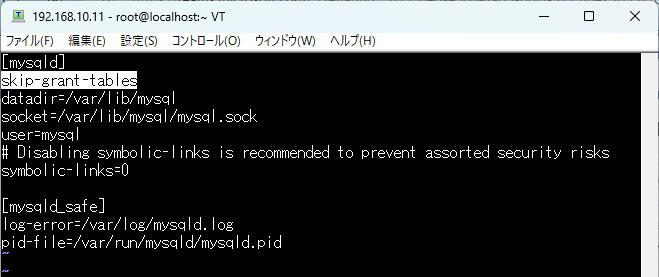

以下のサイトからインストールするバージョンのrpmを探します。

[MySQL Product Archives](https://downloads.mysql.com/archives/community/)

<br>

今回はバージョン5.7.16をダウンロードします。


<br>

以下のコマンドを実行し、rpmをダウンロードします。

```
wget https://downloads.mysql.com/archives/get/p/23/file/mysql-community-server-5.7.16-1.el6.x86_64.rpm
```

<br>

インストール

```bash
rpm -qpl mysql-community-server-5.7.16-1.el6.x86_64.rpm
```

<br>


サービスのスタート

```
service mysqld start
```

<br>

初期パスワード確認

```
grep 'temporary password' /var/log/mysqld.log
```

<br>

初期パスワードが見つからなかった場合のログイン方法<br>
/etc/my.cnfにskip-grant-tablesを追記します。

```
vi /etc/my.cnf
```

```
skip-grant-tables
```



<br>

MySQLを再起動

```
service mysqld restart
```
