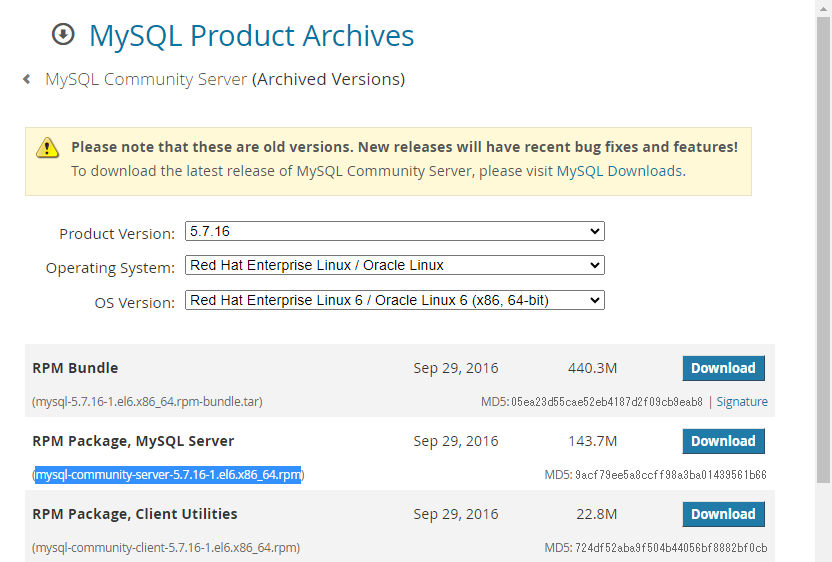

以下のサイトからインストールするバージョンのrpmを探します。

[MySQL Product Archives](https://downloads.mysql.com/archives/community/)

<br>




```
wget https://downloads.mysql.com/archives/get/p/23/file/mysql-community-server-5.7.16-1.el6.x86_64.rpm
```

